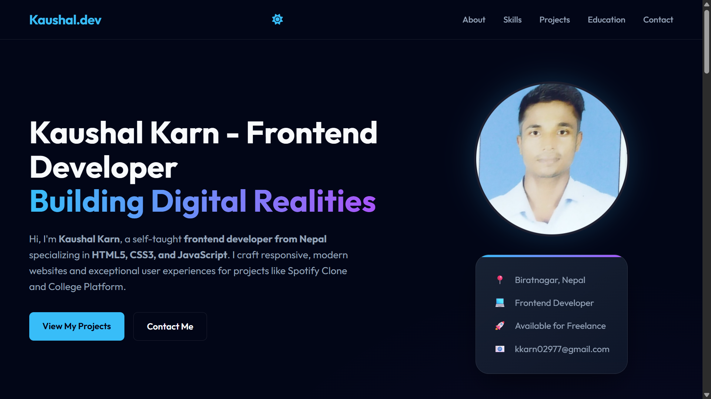

# 👋 Portfolio 2026

> A modern, responsive, and SEO-optimized personal portfolio website built with **HTML5**, **CSS3**, and **Vanilla JavaScript**. Designed with a premium **glassmorphism** aesthetic to showcase my projects, skills, and web development experience.

<p align="center">
  <a href="https://kaushal-karna.github.io/portfolio-2026/">
    
  </a>
  <a href="https://github.com/kaushal-karna/portfolio-2026">
    
  </a>
</p>

---

## 🚀 Features

- 🎨 **Modern UI** – Dark theme with glassmorphism effects and smooth gradients.
- 📱 **Fully Responsive** – Optimized for desktop, tablet, and mobile devices.
- ⚡ **Fast Performance** – Lightweight and framework-free.
- 🔍 **SEO Optimized** – Semantic HTML, Open Graph tags, and meta tags.
- ✨ **Interactive Animations** – Scroll animations powered by `IntersectionObserver`.
- 📬 **Contact Form** – Client-side validation with responsive layout.
- 🎯 **Accessible Design** – Clean navigation and user-friendly interface.

---

## 🛠️ Tech Stack

| Technology | Purpose |
|------------|---------|
| HTML5 | Semantic page structure |
| CSS3 | Styling, Grid, Flexbox, Animations |
| JavaScript (ES6+) | Interactivity and DOM Manipulation |

---

## 📂 Project Structure

```text
portfolio-2026/
│
├── assets/
│   ├── css/
│   ├── js/
│   ├── images/
│   └── icons/
│
├── index.html
├── README.md
└── LICENSE
```

---

## 🚀 Getting Started

### Clone the repository

```bash
git clone https://github.com/kaushal-karna/portfolio-2026.git
```

### Navigate into the project

```bash
cd portfolio-2026
```

### Open the project

Simply open `index.html` in your browser.

Or, for a better development experience, use **VS Code Live Server**.

---

## 🌐 Live Demo

🔗 **Portfolio:**  
https://kaushal-karna.github.io/portfolio-2026/

---

## 📸 Preview

> Add a screenshot or GIF here.

Example:

```md

```

---

## 🤝 Contributing

Contributions, suggestions, and improvements are welcome.

1. Fork the repository.
2. Create a new branch.
3. Commit your changes.
4. Push to your branch.
5. Open a Pull Request.

---

## 📄 License

This project is licensed under the **MIT License**.

See the [LICENSE](LICENSE) file for details.

---

## 👨‍💻 Author

**Kaushal Karn**

- 🌐 Portfolio: https://kaushal-karna.github.io/portfolio-2026/
- 💻 GitHub: https://github.com/kaushal-karna
- 📧 Email: kaushalkarnakayansh@gmail.com
- 💼 LinkedIn: https://www.linkedin.com/in/kaushal-karn/

---

<div align="center">

⭐ If you like this project, consider giving it a star on GitHub!

Made with ❤️ by **Kaushal Karn**

</div>
